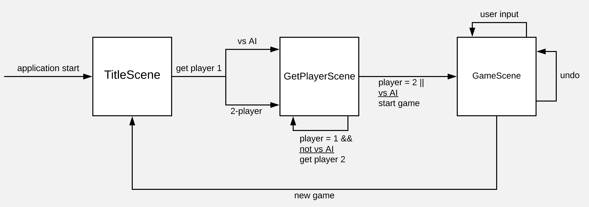

# [Semesteroppgave 2: “Fire på rad”](https://retting.ii.uib.no/inf101.v18.sem2/blob/master/SEM-2.md)

* **README**
* [Oppgavetekst](SEM-2.md)

Dette prosjektet inneholder [Semesteroppgave 2](SEM-2.md). Du kan også [lese oppgaven online](https://retting.ii.uib.no/inf101.v18.oppgaver/inf101.v18.sem2/blob/master/SEM-2.md) (kan evt. ha små oppdateringer i oppgaveteksten som ikke er med i din private kopi).

**Innleveringsfrist:**
* Hele oppgaven skal være ferdig til **fredag 27. april kl. 2359** ([AoE](https://www.timeanddate.com/worldclock/fixedtime.html?msg=4&iso=20180427T2359&p1=3399))
* [Ekstra tips til innlevering](https://retting.ii.uib.no/inf101/inf101.v18/wikis/innlevering)

(Kryss av under her, i README.md, så kan vi følge med på om du anser deg som ferdig med ting eller ikke.)

**Utsettelse:** Hvis du trenger forlenget frist er det mulig å be om det (spør gruppeleder – evt. foreleser/assistenter hvis det er en spesiell situasjon). Hvis du ber om utsettelse bør du være i gang (ha gjort litt ting, og pushet) før fristen
   * En dag eller to går greit uten begrunnelse.
   * Eksamen er relativt tidlig i år, så vi vil helst unngå lange utsettelser.
   * Om det er spesielle grunner til at du vil trenge lengre tid, så er det bare å ta kontakt, så kan vi avtale noe. Ta også kontakt om du [trenger annen tilrettelegging](http://www.uib.no/student/49241/trenger-du-tilrettelegging-av-ditt-studiel%C3%B8p). 
   
# Fyll inn egne svar/beskrivelse/kommentarer til prosjektet under
* Levert av:  Joakim Algrøy (jal043)
* [x] hele semesteroppgaven er ferdig og klar til retting!
* Code review:
   * [ ] jeg har fått tilbakemelding underveis fra @brukernavn, ...
   * [ ] jeg har gitt tilbakemelding underveis til @brukernavn, ...
* Sjekkliste:
   * [x] Kjørbart Fire på Rad-spill
   * [x] Forklart designvalg, hvordan koden er organisert, abstraksjon, og andre ting 
   * [x] Tester
   * [x] Dokumentasjon (JavaDoc, kommentarer, diagrammer, README, etc.)
   * [x] Fornuftige navn på klasser, interfaces, metoder og variabler
   * [x] Fornuftige abstraksjoner og innkapsling (bruk av klasser, interface, metoder, etc.)

## Oversikt

Jeg har implementert et grafisk fire-på-rad spill med et space-tema. Man kan enten spille lokal 2-player, eller spille mot en AI jeg har implementert. AIen heter HAL 9000 og er inspirert av filmen *2001: A space odyssey*.

Programmet består av ~1850 linjer med kode fordelt på 22 klasser (inkludert tester og generatorer), 5 interfaces og 2 enums. 

Jeg har forsøkt å skrive et oversiktlig program med abstraksjon der det er hensiktsmessig, og forsøkt å generalisere ting for lett utvidelse.

### Bruk
* For å starte programmet kjør: `inf101.v18.sem2.Main`
* Velg 2-player eller å spille mot AI, velg så navn og brikker. Man kan legge brikker ved å klikke på en kolonne eller bruke 1-7 på tastaturet.

## Designvalg

### GUI

Grafikken er implementert med JavaFX.
Jeg har tre klasser ([TitleScene](src/inf101/v18/sem2/gui/TitleScene.java), [GetPlayerScene](src/inf101/v18/sem2/gui/GetPlayerScene.java) og [GameScene](src/inf101/v18/sem2/gui/GameScene.java)) som utvider `javafx.scene.Scene` og setter opp ulike visninger.
Disse tre klassene gjør mesteparten av jobben for grafikken, og jeg mener det fungerer bra.
Jeg har tegnet et tilstandsdiagram for å vise flyten mellom de tre visningene:

`GameScene` har en `AnimationTimer` som oppdaterer spillet 60 ganger i sekundet. Dette la jeg til for å kunne animere at brikke faller. `AnimationTimer` forenklet også litt ved at event-handlers ikke trenger å tegne brettet på nytt. Jeg fikk idèen til å bruke `AnimationTimer` fra lab 1, og så også på hvordan de fallende ballene var implementert i lab 1.

Jeg har en hjelpe-klasse [GuiUtil](src/inf101/v18/gui/GuiUtil.java) som har statiske konstanter og metoder relatert til grafikk, som jeg ikke følte hørte hjemme i andre klasser.
Min laptop har høyoppløselig skjerm (13" med 3200x1800), så jeg la til en skaleringsfaktor `GuiUtil.SF` som ganges med alle dimensjoner for grafiske objekter. For 1080p kan denne settes til 1. Det finnes nok bedre måter å gjøre dette på, men jeg har ikke brukt så mye grafikk før og dette var en enkel løsning.

### Game

Logikken og hendelsene i selve spillet er implementert i klassen [Game](src/inf101/v18/sem2/game/Game.java). Den holder styr på spillere, brettet og spillets nåværende tilstand, og håndterer bruker-input.
Metoden `drop()` trigges enten av en bruker eller en AI, og slipper en brikke i den oppgitte kolonnen.
Når en brikke slippes opprettes en [FallingDisc](src/inf101/v18/sem2/game/objects/FallingDisc.java) som Game lagrer. 
Når `Game.step()` kalles oppdateres `FallingDisc`, og hvis den har landet kalles `nextTurn()` som gir turen til neste spiller, og utløser et trekk hvis det er en AI sin tur.
Game har en `int turn` som teller opp for hvert trekk, slik at man kan hente hvem sin tur det er med `turn % 2`.

`game.draw()` tegner selve spill-brettet v.h.a. en GraphicsContext.

Jeg har forsøkt å generalisere ting, så man kan f.eks. endre verdien for `columns` og `rows` i `Game`, og spillet vil fungere fint (hvis man bruker mus til input).

### Spillere

Spillere er av typen [IPlayer](src/inf101/v18/sem2/player/IPlayer.java), som er en interface som implementeres av to klasser, [Player](src/inf101/v18/sem2/player/Player.java) og [HAL](src/inf101/v18/sem2/player/HAL.java) (`HAL` implementerer `IAI extends IPlayer`). 
Spillere har et navn og en brikke. 

AI-spillere har i tillegg en metode `getMove(Game game)` som returnerer et trekk for det gitte spillet.

**HAL**

AIet mitt, [HAL](src/inf101/v18/sem2/player/HAL.java), er basert på ett sjakk-AI jeg har jobbet med i løpet av semesteret. Det bruker rekursjon for å simulere flere trekk fremover, og gir en poengsum til trekket basert på posisjonen på brettet etter de simulerte trekkene gjennomføres.
Det viste seg vanskeligere enn jeg hadde tenkt å gi en god tallverdi på det nåværende brettet (`ratePosition()`), så for øyeblikket gir den bare poeng om man har fire på rad, og minus-poeng om motstanderen har det.
(I sjakk var dette enklere, man kan f.eks. bare se på hvilke brikker som er igjen på brettet). Til gjengjeld kan man her søke litt dypt (5 trekk frem går veldig raskt).

Det er relativt enkelt å slå maskinen hvis man følger med. Den gjør en del tabber, men hvis man har tre på rad og den har mulighet til å blokkere, så gjør den det.

### Brett

Jeg har laget en enkel generisk 2d-grid i [IGrid](src/inf101/v18/sem2/datastructures/IGrid.java) og [Grid](src/inf101/v18/sem2/datastructures/Grid.java).
[IBoard](src/inf101/v18/sem2/datastructures/IBoard.java) og [Board](src/inf101/v18/sem2/datastructures/Board.java) er generiske brett hvor man kan legge til elementer i kolonner, og elementene legger seg i nederste ledige posisjon. 
Man kan også fjerne øverste element i en kolonne. `Board` bruker en `Grid` til å lagre elementene. Jeg vurderte å implementere `Board` som en samling av stacks, siden hver kolonne oppfører seg som en stack, men jeg ønsket også å aksessere elementer med x-y-koordinater så en grid fungerte greit.

`Game` bruker `Board<Disc>` til å representere brettet. Tomme posisjoner har element null. 

[Disc](src/inf101/v18/sem2/game/objects/Disc.java) er en enum som er brikkene i spillet. En `Disc` tegnes med `Disc.draw()`, som henter et tilhørende bilde fra `GuiUtil.getDiscImage()`.

### Regler

Regler er implementert i klassen [Rules](src/inf101/v18/sem2/game/Rules.java), som har statiske metoder som `isWin()`, `isDraw()`, `isLegalMove()`, og `getLegalMoves()`.

### Bruk av abstraksjon

Jeg har forsøkt å abstrahere ut ting som logisk kan skilles fra hverandre. [Main](src/inf101/v18/sem2/Main.java) er veldig kort, og gjør ikke annet enn å starte det grafiske grensesnittet. De ulike visningene i GUIet er representert med egne klasser, og de mest avanserte grafiske elementene ([DiscSelector](src/inf101/v18/sem2/gui/DiscSelector.java) og [SideBar](src/inf101/v18/sem2/gui/SideBar.java)) er skilt ut i egne klasser. Jeg har forsøkt å holde koden for grafikk i klassene i `inf101.v18.sem2.gui`, men har måtte ha litt grafikk i `Game` (`draw()`, `getClip()`), `Disc` og `FallingDisc`.

`Game` representerer hele spillet, og er dermed av de mer avanserte klassene. Jeg kunne standarisert `Game` og laget en interface `IGame`, men slik jeg har skrevet det er `Game` ganske sterkt knyttet til resten av programmet, så det ville ikke blitt et "rent og fint" API. `Board` mener jeg er en god abstraksjon av brettet, og kan lett brukes i andre applikasjoner eller byttes ut med andre implementasjoner.

Jeg mener det fungerer bra å ha en felles type for spillere og AI (`IPlayer`). `Player` er bare en datastruktur og har ikke noe logikk, men jeg har etter hvert tenkt at å håndtere brukerinput i spiller-klassene ville gitt mening (jeg håndterer dette i `Game`). Det vil være enkelt å bytte ut `HAL` med en ny AI, alt den trenger er en `getMove()`-metode.

### Erfaring – hvilke valg viste seg å være gode / dårlige?

Jeg hadde lenge en stor og rotete `Main`-klasse som håndterte GUI. Jeg skulle begynt å lage abstraksjoner for visninger tidligere, men litt av grunnen til at jeg ikke gjorde det var at jeg var usikker på hvordan det best kunne gjøres. Jeg fikk idèen til å utvide `Scene`, og det fungerer bra. Jeg vet fortsatt lite om "best practices" i JavaFX, men nå kan jeg vertfall nok til at jeg lettere kan bygge opp en fornuftig struktur neste gang.
Jeg skulle også gjerne hatt støtte for fullskjerm og mer dynamsik skalering, men med liten erfaring med JavaFX var det dette jeg fikk til.

Jeg skulle også gjerne generalisert `Rules`, akkurat nå er den hardkodet for **fire** på rad. 
Hvis metodene tok inn et argument som sa hvor mange på rad man skulle lete etter kunne jeg f.eks. brukt dette i AIen, eller latt brukeren velge hvor mange på rad man skulle spille om.
Jeg har ikke prioritert å skrive om disse metodene når de fungerer fint til dette spillet.

Å ha enkle, generiske datastrukturer som `Grid` og `Board` har vært nyttig, jeg har nesten ikke rørt de siden jeg først implementerte dem.

Spillet bruker en del prosessorkraft til å tegne spillet 60 ganger i sekundet. Dette kan nok effektiviseres, f.eks. ved at bare elementer som har endret seg tegnes på nytt.
Jeg implementerte animasjonen såpass sent at det ikke var enkelt å bare tegne de oppdaterte tingene, og jeg må i stedet tegne alt på nytt i hver syklus.
Hvis jeg hadde passet på dette fra begynnelsen av ville det vært enklere å gjøre applikasjonen mer effektiv.

## Testing

Jeg har tre testklasser, [BoardTest](src/inf101/v18/sem2/tests/BoardTest.java), [GridTest](src/inf101/v18/sem2/tests/GridTest.java), og [RulesTest](src/inf101/v18/sem2/tests/RulesTest.java).
Jeg tester at datastrukturene oppfører seg som de skal, og at reglene i Rules fungerer. For å hjelpe med testingen har jeg også implementert generatorer for `Disc`, `Grid` og `Board` i `inf101.v18.sem2.generators`. Disse implementerer `IGenerator` som jeg har lånt fra lab 5.

## Funksjonalitet, bugs

Jeg har beskrevet det meste av funksjonaliteten over. Et par ting jeg ønsket å implementere:

* Markere hvor man har fått fire på rad når noen vinner. Jeg har lagt til en metode for dette i `Rules`, men har ikke implementert det enda.
* Flere AI, med ulike måter å finne trekk på, og så la brukeren velge hvilken AI man skal spille mot. Vil være relativt enkelt å implementere slik jeg har strukturert programmet (legge til en `SelectAI` scene).

Håper ikke det er noen store bugs. Jeg tror jeg har fått fikset det meste som dukket opp underveis.

## Evt. erfaring fra code review

Jeg har ikke fått gjennomført code review.

## Annet

Gøy oppgave!
